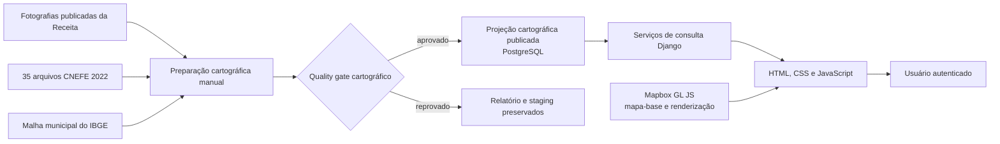

# Mapa de estabelecimentos — validação arquitetural

**Status:** grill concluído; implementação autorizada e validada internamente
**Decisor:** Tiago, como Product Owner
**Audiência de validação:** equipe do Rastro PJ e professor orientador

## Objetivo em validação

Adicionar ao monólito do Rastro PJ uma visualização geográfica capaz de revelar concentrações, distribuições e padrões dos estabelecimentos do recorte regional, com filtros coerentes com as competências publicadas.

## Fatos verificados

- A competência ativa mais recente é `2026-08`.
- Ela contém 706.035 ocorrências regionais de estabelecimento, das quais 270.411 possuem situação cadastral `02 — ATIVA`.
- Os estabelecimentos ativos correspondem a 189.207 chaves de endereço e 11.224 CEPs distintos.
- Araguari possui 16.086 estabelecimentos ativos, 12.615 endereços e 1.167 CEPs; Uberlândia possui 147.081 estabelecimentos ativos, 90.140 endereços e 4.753 CEPs.
- Araguari e Uberlândia somam 163.167 estabelecimentos ativos, 102.755 endereços e 5.920 CEPs.
- As fotografias de estabelecimento possuem endereço e CEP, mas ainda não possuem latitude ou longitude.
- O Mapbox GL JS oferece renderização, camadas, filtros e clustering; a obtenção das coordenadas é uma responsabilidade separada.
- Resultados temporários da Mapbox Geocoding API não podem ser persistidos; a modalidade permanente é paga.
- O CNEFE 2022 do IBGE é público, possui endereço, CEP, latitude, longitude e nível de geocodificação, e pode ser obtido por município.
- Os 35 arquivos CSV municipais do CNEFE que correspondem ao recorte aprovado somam aproximadamente 21,6 MiB compactados no repositório oficial do IBGE.
- O CNEFE não determina a situação cadastral do estabelecimento: a elegibilidade continua vindo da fotografia da Receita na competência selecionada. O CNEFE apenas fornece uma referência espacial que pode ou não corresponder ao endereço atual.
- Em experimento descartável com os 147.081 estabelecimentos ativos de Uberlândia, o CNEFE encontrou 96,17% por CEP, 82,54% por `CEP + logradouro` e 65,31% por `CEP + logradouro + número`. Essa amostra orienta a estratégia, mas ainda não representa a cobertura final dos 35 municípios.
- Dos 96.060 estabelecimentos correspondidos por `CEP + logradouro + número` em Uberlândia, 68.750 apontaram para uma única coordenada CNEFE e 27.310 para mais de uma coordenada do mesmo endereço.
- As 13 competências contêm 3.483.375 ocorrências elegíveis ao mapa, referentes a 318.695 estabelecimentos que estiveram ativos em ao menos uma competência, 220.581 chaves de endereço e 11.447 CEPs distintos.
- No portal atual, dashboard, busca, detalhe empresarial e eventos não exigem autenticação; importações e empresas monitoradas exigem login. Um mapa consultável amplia a capacidade de exploração e coleta em massa dos endereços.
- O experimento completo leu 961.993 endereços CNEFE nos 35 municípios, sem latitude ou longitude ausente e sem coordenada fora dos limites amplos de Minas Gerais usados na verificação.
- Na competência `2026-08`, a cobertura dos 270.411 estabelecimentos elegíveis foi 95,18% por CEP, 75,38% por `CEP + logradouro` e 59,70% por `CEP + logradouro + número`.
- A mediana municipal de cobertura por CEP foi 99,77%; Frutal apresentou a menor cobertura, 74,31%, seguida de Araporã, com 84,43%.
- O CNEFE usa os níveis oficiais `1` a `6`: coordenada original, modificada, estimada, face de quadra, localidade e setor censitário. O nível da fonte limita a precisão que o produto pode declarar.
- Entre as correspondências de endereço, 37.695 estabelecimentos apontaram para múltiplas coordenadas CNEFE; a dispersão mediana foi 10,8 metros e o percentil 90 foi 217 metros.

## Restrições confirmadas

- A POC não pode gerar custo de consumo de API.
- A aplicação permanece monolítica e executada localmente.
- O Product Owner autorizou explicitamente a implementação em 7 de setembro de 2026.

## Ledger de decisões

### D1 — Papel do mapa

**Decisão:** construir um **Mapa Analítico Regional**, com agregação nas escalas amplas e estabelecimentos individuais apenas após aproximação ou aplicação de filtros.

**Consequências:** o mapa prioriza análise de concentração e distribuição; um localizador cadastral irrestrito não pertence à POC.

### D2 — Elegibilidade cadastral

**Decisão:** incluir somente ocorrências regionais de estabelecimentos com situação cadastral `02 — ATIVA` na competência selecionada.

**Consequências:** as demais situações e análises de encerramento ficam fora do mapa inicial. O produto evita a expressão imprecisa “empresa ativa”, pois a situação cadastral pertence ao estabelecimento.

### D3 — Fonte das coordenadas

**Decisão:** usar o CNEFE 2022 do IBGE como fonte primária gratuita das coordenadas e o Mapbox GL JS como renderizador do mapa.

**Consequências:** a Receita continua sendo a fonte da situação cadastral e da competência; o CNEFE não limita a análise a estabelecimentos existentes em 2022. O cruzamento deverá declarar cobertura, método e precisão, admitindo endereço atual não localizado pela referência de 2022.

### D4 — Recorte cartográfico

**Decisão:** cobrir os 35 municípios do Triângulo Mineiro já pertencentes ao recorte geográfico do produto desde a POC cartográfica.

**Consequências:** Araguari e Uberlândia não formarão uma limitação funcional do mapa. Consultas e visualizações deverão evitar que municípios de maior porte ocultem padrões das cidades menores.

### D5 — Precisão espacial

**Decisão:** aplicar a cascata `endereço CNEFE → aproximação pelo CEP → não localizado`, preservando e exibindo o método usado em cada resultado.

**Consequências:** nenhuma coordenada será fabricada. Correspondências no nível do endereço e aproximações pelo CEP serão distinguíveis; registros não localizados continuarão nos indicadores de cobertura, mas não receberão ponto no mapa. A POC deverá informar a cobertura de cada nível.

### D6 — Estado temporal do mapa

**Decisão:** representar exatamente uma competência por vez, abrir na competência publicada mais recente e permitir alternância entre as 13 competências da janela ativa.

**Consequências:** elegibilidade, endereço, filtros e indicadores serão calculados na competência cartográfica selecionada. A POC não misturará competências nem oferecerá intervalo, animação ou comparação lado a lado.

### D7 — Insight principal

**Decisão:** demonstrar prioritariamente onde se concentram os estabelecimentos ativos de determinada atividade econômica e como essa presença se distribui entre os municípios do Triângulo Mineiro.

**Consequências:** a POC deverá permitir que uma pessoa selecione uma competência e uma atividade e compreenda sua distribuição geográfica. A interface tratará o resultado como concentração cadastral observada, sem afirmar demanda, faturamento ou oportunidade comercial comprovada.

### D8 — Filtros da POC

**Decisão:** oferecer competência, município, CNAE principal, matriz/filial, porte, perfil tributário, precisão espacial e período de abertura do estabelecimento.

**Consequências:** os oito filtros serão combináveis e atualizarão visualização e indicadores. O período de abertura será calculado em relação à competência escolhida, nos recortes de 1, 3, 6 ou 12 meses. Bairro, capital social, sociedade, eventos, fontes de risco e pesquisa textual no mapa ficam fora da POC. Pesquisa por nome ou CNPJ permanece no fluxo empresarial existente.

### D9 — Hierarquia visual

**Decisão:** adotar o fluxo progressivo `municípios → clusters → estabelecimentos`, usando a malha municipal gratuita do IBGE na visão regional.

**Consequências:** a abertura mostrará somente os 35 polígonos com contagem absoluta filtrada; a aproximação carregará concentrações espaciais; pontos ou endereços compartilhados aparecerão apenas no nível local. Heatmap, 3D e animações ficam fora da POC.

### D10 — Indicadores

**Decisão:** recalcular conforme os filtros seis indicadores — estabelecimentos ativos, empresas distintas, municípios com presença, matrizes e filiais, perfil tributário e cobertura geográfica — acompanhados de rankings contextuais de municípios e CNAEs.

**Consequências:** nenhum indicador afirmará faturamento, market share, melhor localização comercial ou concorrência real. Todos usarão a mesma competência cartográfica e os mesmos filtros da visualização.

### D11 — Propriedade dos dados geográficos

**Decisão:** persistir coordenadas e métodos de correspondência numa projeção cartográfica derivada e recalculável, separada das fotografias normalizadas da Receita, mas mantida no mesmo monólito e PostgreSQL.

**Consequências:** a projeção relacionará competência, estabelecimento, endereço utilizado, localização qualificada e versão auditada do CNEFE. Corrigir ou substituir a referência geográfica não reescreverá a evidência cadastral da Receita.

### D12 — Preparação da projeção

**Decisão:** resolver previamente os endereços distintos e materializar, validar e publicar a projeção cartográfica das 13 competências completas, sem geocodificação durante requisições web.

**Consequências:** a preparação será manual, idempotente, retomável e auditada. Um mesmo resultado de endereço será reutilizado nas ocorrências correspondentes; Celery, RabbitMQ, Temporal e cron não pertencem à POC cartográfica.

### D13 — Banco geoespacial

**Decisão:** manter o PostgreSQL 17 atual, armazenar latitude e longitude em campos numéricos indexados e não adicionar PostGIS à POC.

**Consequências:** consultas usarão competência, município, coordenadas e caixa visível. PostGIS permanece no roadmap, condicionado a busca por raio, polígonos livres, vizinhos mais próximos, junções espaciais ou desempenho que os índices convencionais não atendam.

### D14 — Entrega dos dados

**Decisão:** executar filtros e agregações no backend, considerando competência, filtros, zoom e área visível, e limitar o nível detalhado a 5 mil localizações por resposta.

**Consequências:** o servidor responderá com municípios, agregados intermediários, localizações ou estabelecimentos paginados conforme o nível. Ao exceder o limite, aumentará a agregação e informará essa condição; nunca retornará uma amostra silenciosamente truncada.

### D15 — Token do Mapbox

**Decisão:** utilizar um token público `pk.` dedicado ao Rastro PJ, com privilégios mínimos, restrição a `http://localhost:8000` e valor real mantido fora do Git.

**Consequências:** o token padrão da conta e tokens secretos `sk.` não serão usados. A ausência ou rejeição da credencial degradará somente o mapa, com orientação de configuração, sem impedir o restante da aplicação.

O Mapbox GL JS v3 exige token válido para instanciar `Map` e contabiliza um map load por instância mesmo quando não há recurso cartográfico hospedado pela Mapbox. Por isso, a aplicação cria no máximo uma instância por carregamento da página e não tenta inicializar o mapa sem token; um estilo local sem credencial não eliminaria essa exigência nem a contabilização.

### D16 — Controle de acesso

**Decisão:** exigir autenticação na página do mapa e em todos os endpoints cartográficos, mantendo inalteradas as regras de acesso dos demais fluxos atuais.

**Consequências:** respostas agregadas transportarão somente atributos necessários; identificadores aparecerão apenas no nível local e paginado; a POC não fornecerá exportação integral dos pontos. Perfis e permissões mais granulares ficam no roadmap.

### D17 — Precisão dos estabelecimentos MEI

**Decisão:** aplicar aos estabelecimentos de empresas MEI a mesma cascata de precisão `endereço CNEFE → aproximação pelo CEP → não localizado` usada para os demais estabelecimentos, sem redução preventiva ao nível do CEP.

**Consequências:** a POC preservará a precisão disponível por se tratar de endereço cadastral público e acesso autenticado, local, paginado e sem exportação integral. O Product Owner aceita que alguns pontos possam coincidir com residências. Essa decisão deverá ser reavaliada antes de qualquer publicação externa.

**Alternativa rejeitada:** reduzir todo estabelecimento MEI ao nível do CEP por privacidade; rejeitada por remover precisão de dados públicos também para estabelecimentos comerciais.

### D18 — Quality gate geográfico

**Decisão:** exigir cobertura geral mínima de 90%, cobertura mínima de 70% em cada município e aprovação integral das verificações estruturais antes de publicar a projeção.

**Consequências:** arquivos, hashes, schema, municípios, coordenadas e níveis CNEFE serão validados. Cobertura de endereço será reportada sem limite bloqueante próprio; queda superior a cinco pontos percentuais exigirá revisão. Nenhuma regra do produto poderá promover a precisão declarada pela fonte.

### D19 — Múltiplas coordenadas

**Decisão:** para múltiplos candidatos do melhor nível CNEFE com dispersão de até 100 metros, usar um ponto CNEFE real próximo da mediana; acima desse limite, classificar o endereço como ambíguo e rebaixar ao CEP.

**Consequências:** quantidade de candidatos, dispersão, nível da fonte e motivo da escolha serão auditáveis. O desempate será estável pelo identificador CNEFE. Aproximações por CEP também escolherão um ponto CNEFE real representativo, sem fabricar uma coordenada média.

### D20 — Operação degradada

**Decisão:** degradar somente o componente indisponível, preservar a última projeção publicada e manter filtros, indicadores, rankings e tabela municipal quando a renderização Mapbox falhar.

**Consequências:** nova projeção será publicada atomicamente somente após o quality gate. Falha de endpoint preservará o último estado válido; ausência de dados, erro técnico, credencial rejeitada e projeção ainda não preparada terão estados distintos. Não haverá troca automática de provedor.

### D21 — Definition of Done

**Decisão:** submeter a POC a critérios objetivos funcionais, de dados, segurança, desempenho, testes e acessibilidade.

**Consequências:** consultas locais com banco aquecido terão p95 de até 1 segundo para resumo e indicadores e até 1,5 segundo para agregações e detalhe; a preparação terá meta inicial de 30 minutos e pico inferior a 2 GiB. Mesmas fontes deverão gerar os mesmos resultados e nenhuma chamada de teste consumirá Mapbox.

## Escopo fechado

### Incluído

- página cartográfica autenticada no monólito Django;
- 35 municípios do recorte geográfico existente;
- 13 competências, uma por vez, com a mais recente como padrão;
- somente ocorrências regionais com situação cadastral `02 — ATIVA`;
- coordenadas gratuitas derivadas do CNEFE 2022;
- malha municipal oficial do IBGE;
- Mapbox GL JS como renderizador, dentro da faixa gratuita;
- cascata de correspondência por endereço, CEP e não localizado;
- mesma precisão para MEI e não MEI;
- oito filtros e seis indicadores aprovados;
- visão progressiva por município, agregação e estabelecimento;
- preparação integral, manual, idempotente, retomável e auditável;
- projeção derivada publicada atomicamente;
- estados degradados e tabela alternativa ao mapa.

### Excluído

- Mapbox Geocoding API, temporária ou permanente;
- PostGIS, Celery, RabbitMQ, Temporal e cron;
- intervalos simultâneos, animação ou comparação temporal lado a lado;
- estabelecimentos em situação diferente de ativa;
- heatmap, 3D, busca por raio, desenho de polígonos e rotas;
- bairro como filtro canônico;
- capital social, sociedade, eventos e fontes de risco no mapa;
- inferência de demanda, faturamento, market share ou melhor local comercial;
- exportação integral dos pontos e publicação externa da POC.

## Arquitetura validada

O Mapbox não recebe a base da Receita nem o CNEFE e não geocodifica endereços. Ele fornece mapa-base, estilo e renderização no navegador. Dados empresariais permanecem no Django e no PostgreSQL local.

## Modelo lógico proposto

Os nomes finais poderão seguir a convenção do código, mas as responsabilidades estão congeladas:

| Componente | Responsabilidade |
|---|---|
| Fonte geográfica | versão, URLs, hashes, schema, arquivos e contagens do CNEFE e da malha municipal |
| Resolução de endereço | impressão digital normalizada, município, método, coordenada representativa, nível CNEFE, candidatos, dispersão e motivo |
| Projeção cartográfica | janela, fonte, status, relatório de qualidade, timestamps de preparação e publicação |
| Observação cartográfica | competência, empresa, estabelecimento, município, localização, CNAE, matriz/filial, porte e perfil tributário necessários aos filtros |

A observação cartográfica é um read model derivado. Nenhum de seus campos substitui a fotografia normalizada que originou o registro.

## Fluxo de preparação

1. inventariar os 35 arquivos municipais e a malha do IBGE;
2. validar URLs, hashes, schema, códigos IBGE e coordenadas;
3. normalizar os endereços CNEFE e os endereços distintos da Receita;
4. resolver candidatos pelo melhor nível CNEFE;
5. aplicar a regra determinística para múltiplas coordenadas;
6. aplicar fallback representativo por CEP;
7. materializar as observações elegíveis das 13 competências em staging;
8. calcular cobertura global, por competência, município e método;
9. executar o quality gate;
10. publicar atomicamente ou preservar a última projeção válida.

O processamento deve reutilizar a capacidade colunar já presente no projeto e realizar gravações em lote. Fontes CNEFE regionais permanecem fora do Git; URLs, hashes, versões e relatórios são auditáveis.

## Contrato de consulta

A página envia competência, filtros, zoom e caixa visível. O backend escolhe o nível de resposta:

| Nível | Resposta completa |
|---|---|
| Regional | 35 geometrias municipais com contagens e indicadores |
| Intermediário | agregados determinísticos por área ou CEP |
| Local | até 5 mil localizações agrupadas dentro da caixa visível |
| Detalhe | estabelecimentos paginados, 25 por página |

Quando o detalhe exceder 5 mil localizações, o servidor responde com agregação mais ampla e metadado explicativo. Não devolve subconjunto silencioso. Filtros inválidos ou fora da janela ativa são rejeitados.

## Comportamentos exemplares

### Caminho principal

1. usuário autenticado abre o mapa em `2026-08`;
2. vê os 35 municípios e os indicadores gerais;
3. seleciona um CNAE e um município;
4. mapa, indicadores e rankings usam o mesmo recorte;
5. aproxima o mapa e recebe agregados completos;
6. aproxima novamente e abre uma localização;
7. consulta estabelecimentos paginados e o nível de precisão.

### Mudança de competência

Ao selecionar outra competência, elegibilidade, endereço, localização, indicadores e rankings são recalculados para aquela fotografia. Um estabelecimento nunca aparece simultaneamente em duas competências.

### Ausência e falha

- filtro legítimo sem correspondências produz estado vazio;
- Mapbox indisponível mantém indicadores, rankings e tabela;
- endpoint indisponível mantém o último estado válido e permite tentar novamente;
- projeção inexistente apresenta orientação de preparação;
- nova preparação reprovada não substitui a projeção publicada.

## Definition of Done detalhada

### Funcional e dados

- os 35 municípios e as 13 competências são navegáveis;
- os oito filtros são combináveis e coerentes entre mapa e indicadores;
- os seis indicadores e rankings conferem com consultas de referência;
- a cascata de localização e os níveis CNEFE são explicáveis;
- cobertura geral é pelo menos 90% e nenhuma cidade fica abaixo de 70%;
- reexecução com mesmas fontes é determinística;
- publicação é atômica e auditável.

### Segurança, privacidade e resiliência

- página e endpoints exigem autenticação;
- token `pk.` dedicado possui privilégios mínimos e restrição a `http://localhost:8000`;
- token real e qualquer token `sk.` não entram no Git;
- nenhuma resposta contém CPF, dados societários ou atributos desnecessários;
- detalhes respeitam limite e paginação;
- endereço de MEI mantém a precisão disponível, com risco aceito para uso local e revisão obrigatória antes de publicação externa;
- estados degradados não derrubam os demais fluxos do produto.

### Desempenho e testes

- resumo e indicadores: p95 local aquecido de até 1 segundo;
- agregações e detalhe: p95 local aquecido de até 1,5 segundo;
- resposta detalhada: no máximo 5 mil localizações;
- preparação: meta inicial de até 30 minutos e pico inferior a 2 GiB;
- testes unitários cobrem normalização, correspondência, ambiguidade e precisão;
- testes de integração cobrem filtros, autenticação, contagens, limites e degradação;
- Mapbox é simulado na suíte, sem consumo externo;
- smoke test manual e tabela alternativa acessível por teclado são documentados.

## Riscos aceitos

- o CNEFE 2022 pode não localizar endereços novos das competências de 2025 e 2026;
- correspondência textual pode produzir falso positivo, mitigado por município, CEP, níveis da fonte e relatório de cobertura;
- algumas coordenadas empresariais de MEI podem coincidir com residências;
- Mapbox é uma dependência externa para a experiência visual;
- contagem cadastral não representa demanda, receita ou participação de mercado;
- limites de tempo e memória da preparação ainda precisam ser comprovados pela implementação.

## Roadmap posterior

- PostGIS para raio, polígonos, vizinhos e junções espaciais;
- camadas de abertura, encerramento e movimentação regional;
- animação ou comparação temporal;
- normalização de bairros;
- indicadores proporcionais por área e outras fontes oficiais;
- integração de CEIS, CNEP, TCU, Lista Suja e CAFIMP;
- heatmap e outras visualizações após validação semântica;
- perfis de acesso, limites de uso e revisão de privacidade para publicação externa.

## Sequência de implementação executada após o gate

1. contratos, modelos, migrações e testes estruturais;
2. inventário e validação das fontes IBGE;
3. resolução de endereços e quality gate;
4. materialização e publicação das 13 competências;
5. serviços de consulta e endpoints autenticados;
6. página, filtros, indicadores e Mapbox GL JS;
7. estados degradados, acessibilidade, desempenho e relatório de evidências;
8. revisão de código e validação final do QA.

## Evidência da implementação

- autorização explícita concedida pelo Product Owner;
- projeção `a5c4eee0-4b21-4184-8b2d-63f6f3dff687` publicada com algoritmo `1.0.1`;
- 3.483.375 observações, 3.316.568 localizadas e cobertura global de 95,21%;
- 35 municípios e 13 competências aprovados pelo quality gate;
- evidência detalhada em [G7 — Mapa analítico regional](evidencias/g7-mapa-analitico-regional.md).

## Adendo experimental — dinâmica territorial

Em 7 de setembro de 2026 foi iniciado, sem alterar o modo padrão da POC, um experimento reversível de comparação entre competências consecutivas. O experimento amplia pontualmente D6, D8 e D9:

- adiciona um modo explícito de dinâmica territorial, separado da concentração atual;
- compara a competência selecionada somente à publicada imediatamente anterior;
- aplica município, CNAE, matriz/filial, porte, perfil tributário e precisão às duas fotografias;
- não combina período de abertura com a comparação;
- apresenta somente os polígonos municipais, sem pontos individuais;
- distingue variação do estoque, aberturas e baixas confirmadas, saldo de ciclo de vida e outros efeitos cadastrais;
- usa escala divergente simétrica e rankings pelo movimento absoluto, preservando o sinal;
- mantém o modo de concentração, suas oito opções de filtro e a navegação progressiva inalterados.

O adendo não transforma comparação cadastral em previsão econômica e não autoriza animação, períodos arbitrários ou atribuição causal ao resíduo. O contrato e os próximos experimentos estão no [roadmap de inteligência territorial](roadmap-inteligencia-territorial.md).

## Adendo experimental — referência demográfica municipal

Em 7 de setembro de 2026, o modo de concentração recebeu um cruzamento reversível com a população residente do Censo 2022:

- o código IBGE de sete dígitos relaciona cada um dos 35 municípios à variável 93 da tabela SIDRA 4709;
- `sync_ibge_population` faz carga manual, integral, idempotente e auditável, sem consulta externa durante requisições web;
- o PostgreSQL preserva fonte, ano, URL, manifesto e SHA-256, além de uma população positiva por município e ano;
- a nona opção de filtro da concentração alterna o mapa e o ranking municipal entre volume absoluto e estabelecimentos por mil habitantes;
- população, estabelecimentos por mil e empresas por mil permanecem visíveis como contexto, acompanhados da cobertura 35/35;
- o GeoJSON e a tabela acessível expõem o mesmo denominador e o mesmo valor relativo;
- a opção relativa exige cobertura demográfica completa e não pode ser combinada com dinâmica territorial;
- a ausência da referência degrada apenas a métrica relativa, preservando a análise absoluta.

“Densidade cadastral populacional” significa `estabelecimentos elegíveis ÷ população residente × 1.000`. O resultado não estima consumidores, emprego, receita, concorrência, produtividade ou potencial de mercado. A competência cadastral e o ano demográfico são diferentes e aparecem explicitamente na interface.

## Fontes externas consultadas

- [Mapbox GL JS — grandes fontes GeoJSON](https://docs.mapbox.com/help/troubleshooting/working-with-large-geojson-data/)
- [Mapbox GL JS — guia de migração e contabilização no v3](https://docs.mapbox.com/mapbox-gl-js/guides/migrate/)
- [Mapbox — preços](https://www.mapbox.com/pricing)
- [Mapbox Geocoding API](https://docs.mapbox.com/api/search/geocoding/)
- [IBGE — Cadastro Nacional de Endereços para Fins Estatísticos](https://www.ibge.gov.br/estatisticas/sociais/populacao/38734-cadastro-nacional-de-enderecos-para-fins-estatisticos.html)
- [IBGE SIDRA — tabela 4709, população residente do Censo 2022](https://sidra.ibge.gov.br/tabela/4709/)
