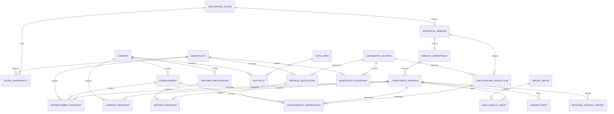
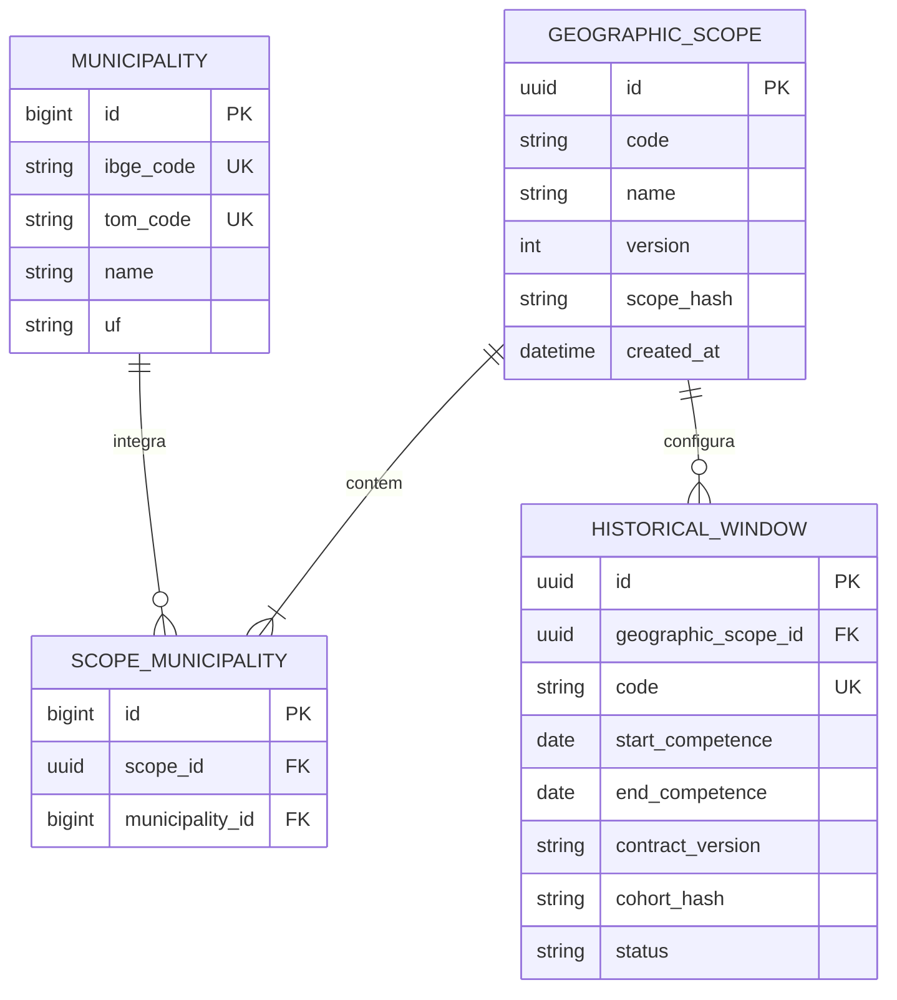
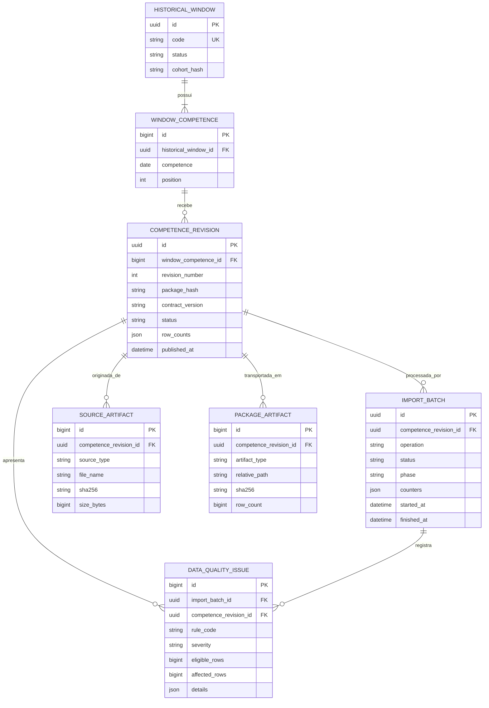
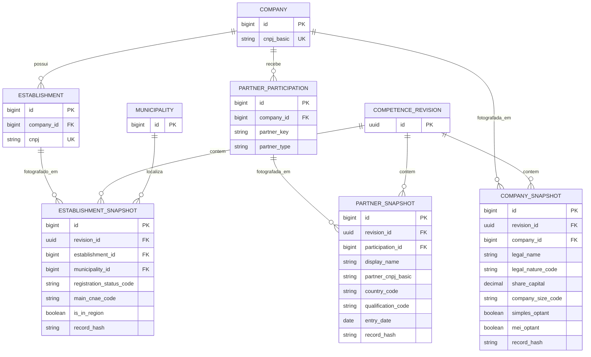
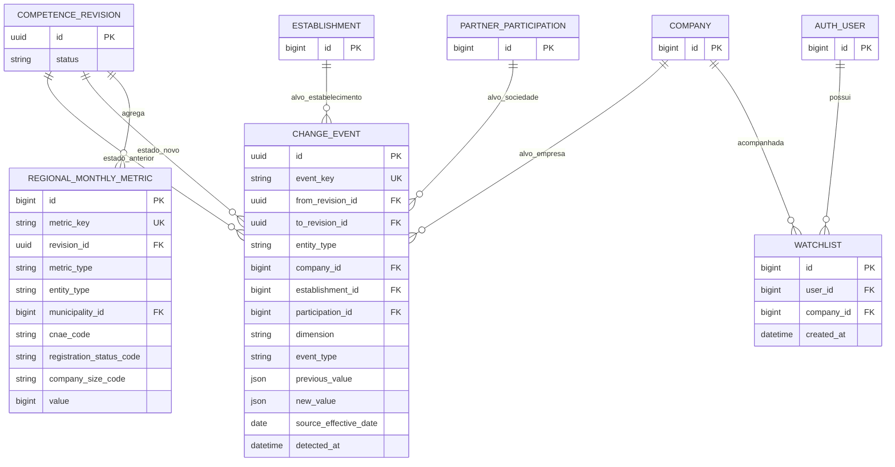
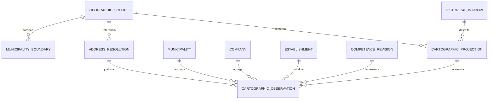

# Modelagem do banco de dados — Rastro PJ

**Estado:** aprovada para implementação inicial  
**Banco-alvo:** PostgreSQL  
**Mapeamento:** Django 5.2 ORM  
**Atualização:** 7 de setembro de 2026
**Escopo:** janela histórica, cadastros, snapshots, revisões, qualidade, eventos, métricas, watchlist e projeção cartográfica

## 1. Objetivos da modelagem

A estrutura proposta precisa garantir que:

- empresa, estabelecimento e participação societária permaneçam entidades distintas;
- cada fotografia pertença a uma revisão específica de uma competência;
- revisões em staging sejam carregadas sem aparecer nas consultas funcionais;
- apenas uma revisão por competência e uma janela possam estar ativas;
- correções preservem a revisão substituída;
- eventos e métricas sejam derivados, auditáveis e recalculáveis;
- ausência de dados seja registrada como qualidade, nunca como baixa automática;
- códigos CNPJ, IBGE, TOM, CNAE e CEP preservem zeros;
- nenhum CPF completo ou mascarado seja persistido;
- o recorte dos 35 municípios seja versionado sem impedir o catálogo de representar municípios externos da coorte.

## 2. Convenções físicas

- tabelas e colunas em `snake_case`;
- chaves internas de alto volume com `BIGINT`;
- identificadores operacionais expostos em manifestos e logs com `UUID`;
- códigos públicos armazenados como `VARCHAR`, nunca como número;
- competência armazenada como `DATE` no primeiro dia do mês e exibida como `AAAA-MM`;
- hashes SHA-256 em `CHAR(64)`;
- dinheiro em `NUMERIC(18,2)`;
- timestamps com fuso horário;
- payloads variáveis somente em `JSONB` com contrato conhecido;
- nomes de constraints e índices explícitos nas migrations;
- tabelas históricas sem exclusão automática.

## 3. Visão conceitual



### Leitura do modelo

O cadastro mestre responde **quem é a entidade**. O snapshot responde **como ela foi observada naquela revisão**. A revisão responde **qual versão de uma competência é oficial**. Evento e métrica respondem **o que foi derivado das fotografias**, sem substituir a evidência original.

## 4. Catálogo geográfico e recorte



`Municipality` representa qualquer município encontrado na coorte. Pertencer aos 35 municípios não é atributo universal do município: é uma relação com a versão do `GeographicScope`. Isso permite reutilizar o catálogo em futuras janelas ou regiões sem reclassificar registros históricos.

## 5. Janela, competências, revisões e lotes



Uma revisão `STAGING` pode ter snapshots carregados, mas não aparece no produto. A publicação atômica marca a revisão anterior como `SUPERSEDED` e a nova como `PUBLISHED` ou `PUBLISHED_WITH_WARNINGS`. Consultas funcionais sempre exigem revisões ativas.

## 6. Cadastros e snapshots



As tabelas mestre não representam “estado atual”. Elas estabilizam identidades e relacionamentos. Todo atributo mutável pertence ao snapshot, mesmo quando raramente muda.

## 7. Eventos, métricas e monitoramento



`ChangeEvent` possui três FKs opcionais de alvo, com `CheckConstraint` exigindo exatamente uma preenchida. `event_key` é um hash determinístico do par de revisões, alvo, dimensão e tipo; ele protege o recálculo idempotente.

`RegionalMonthlyMetric` usa `metric_key` determinística para evitar duplicidade quando dimensões opcionais forem nulas. As colunas mais filtradas permanecem relacionais; `JSONB` pode guardar dimensões auxiliares, mas não será a única forma de consultar município, CNAE, situação ou porte.

## 8. Dicionário de tabelas

### 8.1. Geografia

#### `geography_geographic_scope`

| Coluna | Tipo | Nulo | Regra |
|---|---|---:|---|
| `id` | UUID | não | PK |
| `code` | VARCHAR(50) | não | código estável, como `triangulo-mineiro-35` |
| `name` | VARCHAR(120) | não | nome de exibição |
| `version` | SMALLINT | não | versão do conjunto |
| `scope_hash` | CHAR(64) | não | hash dos códigos IBGE ordenados |
| `created_at` | TIMESTAMPTZ | não | auditoria |

Constraints: `UNIQUE(code, version)` e `UNIQUE(scope_hash)`.

#### `geography_municipality`

| Coluna | Tipo | Nulo | Regra |
|---|---|---:|---|
| `id` | BIGINT | não | PK |
| `ibge_code` | VARCHAR(7) | não | identidade canônica e única |
| `tom_code` | VARCHAR(4) | não | identificador textual da Receita e único |
| `name` | VARCHAR(120) | não | nome oficial |
| `uf` | VARCHAR(2) | não | `MG` para o recorte; externos podem possuir outra UF |
| `created_at` | TIMESTAMPTZ | não | auditoria |

#### `geography_scope_municipality`

| Coluna | Tipo | Nulo | Regra |
|---|---|---:|---|
| `id` | BIGINT | não | PK |
| `scope_id` | UUID | não | FK protegida para `GeographicScope` |
| `municipality_id` | BIGINT | não | FK protegida para `Municipality` |

Constraint: `UNIQUE(scope_id, municipality_id)`. O escopo do MVP deverá possuir exatamente 35 associações, validado pelo serviço e pelo manifesto.

### 8.2. Janela, competência e auditoria

#### `pipeline_historical_window`

| Coluna | Tipo | Nulo | Regra |
|---|---|---:|---|
| `id` | UUID | não | PK e identidade usada no manifesto |
| `geographic_scope_id` | UUID | não | FK protegida |
| `code` | VARCHAR(80) | não | código único da janela |
| `start_competence` | DATE | não | primeiro dia do mês inicial |
| `end_competence` | DATE | não | primeiro dia do mês final |
| `contract_version` | VARCHAR(20) | não | versão dos pacotes |
| `cohort_hash` | CHAR(64) | sim | obrigatório a partir de `VALIDATED` |
| `manifest_hash` | CHAR(64) | sim | obrigatório a partir de `VALIDATED` |
| `status` | VARCHAR(24) | não | `DRAFT`, `PREPARING`, `VALIDATED`, `ACTIVE`, `SUPERSEDED`, `FAILED` |
| `created_at` | TIMESTAMPTZ | não | auditoria |
| `activated_at` | TIMESTAMPTZ | sim | ativação da janela |

Constraints: início não posterior ao fim; apenas uma linha com `status = ACTIVE`; hashes obrigatórios nos estados `VALIDATED`, `ACTIVE` e `SUPERSEDED`.

#### `pipeline_window_competence`

| Coluna | Tipo | Nulo | Regra |
|---|---|---:|---|
| `id` | BIGINT | não | PK |
| `historical_window_id` | UUID | não | FK protegida |
| `competence` | DATE | não | primeiro dia do mês |
| `position` | SMALLINT | não | começa em zero ou um, definido uma vez |

Constraints: `UNIQUE(historical_window_id, competence)`, `UNIQUE(historical_window_id, position)` e competência dentro da janela. Continuidade mensal é validada no serviço e no manifesto.

#### `pipeline_competence_revision`

| Coluna | Tipo | Nulo | Regra |
|---|---|---:|---|
| `id` | UUID | não | PK |
| `window_competence_id` | BIGINT | não | FK protegida |
| `revision_number` | SMALLINT | não | crescente dentro da competência |
| `package_hash` | CHAR(64) | não | idempotência do pacote |
| `contract_version` | VARCHAR(20) | não | compatibilidade |
| `status` | VARCHAR(32) | não | estados aprovados de revisão |
| `warning_count` | INTEGER | não | padrão zero |
| `row_counts` | JSONB | não | contagem por tabela |
| `manifest` | JSONB | não | cópia auditável do manifesto validado |
| `created_at` | TIMESTAMPTZ | não | auditoria |
| `validated_at` | TIMESTAMPTZ | sim | fim da validação |
| `published_at` | TIMESTAMPTZ | sim | publicação efetiva |

Constraints:

- `UNIQUE(window_competence_id, revision_number)`;
- `UNIQUE(window_competence_id, package_hash)`;
- `revision_number > 0`;
- uma única revisão com status `PUBLISHED` ou `PUBLISHED_WITH_WARNINGS` por competência, por índice único parcial.

#### `pipeline_import_batch`

| Coluna | Tipo | Nulo | Regra |
|---|---|---:|---|
| `id` | UUID | não | PK e correlação dos logs |
| `competence_revision_id` | UUID | sim | nula somente quando a falha ocorre antes de criar revisão |
| `operation` | VARCHAR(20) | não | `PREPARE`, `IMPORT`, `RECALCULATE`, `CLEANUP` |
| `status` | VARCHAR(24) | não | estado operacional |
| `phase` | VARCHAR(50) | sim | fase atual ou final |
| `counters` | JSONB | não | contagens sem linhas cadastrais |
| `sanitized_options` | JSONB | não | argumentos sem segredo ou caminho sensível desnecessário |
| `error_code` | VARCHAR(80) | sim | erro normalizado |
| `error_message` | TEXT | sim | mensagem sem dado pessoal |
| `started_at` | TIMESTAMPTZ | não | início |
| `finished_at` | TIMESTAMPTZ | sim | fim |

#### `pipeline_source_artifact`

Campos principais: revisão, tipo da fonte, URL, nome, competência, tamanho, SHA-256 e instante de aquisição. Constraint `UNIQUE(revision_id, source_type, file_name)`.

#### `pipeline_package_artifact`

Campos principais: revisão, tipo (`MANIFEST`, `COMPANIES`, `ESTABLISHMENTS`, `PARTNERS`), caminho relativo, SHA-256, tamanho, linhas e schema. Constraint `UNIQUE(revision_id, artifact_type)`.

#### `pipeline_data_quality_issue`

| Coluna | Tipo | Nulo | Regra |
|---|---|---:|---|
| `id` | BIGINT | não | PK |
| `import_batch_id` | UUID | não | lote que detectou |
| `competence_revision_id` | UUID | sim | pode faltar em erro anterior à revisão |
| `rule_code` | VARCHAR(80) | não | regra estável e documentada |
| `severity` | VARCHAR(16) | não | `FATAL` ou `WARNING` |
| `entity_type` | VARCHAR(24) | sim | entidade afetada |
| `entity_key` | VARCHAR(80) | sim | identificador mínimo, nunca CPF mascarado |
| `eligible_rows` | BIGINT | não | denominador da regra |
| `affected_rows` | BIGINT | não | numerador da regra |
| `details` | JSONB | não | resumo ou amostra minimizada |
| `created_at` | TIMESTAMPTZ | não | auditoria |

Checks: contagens não negativas e `affected_rows <= eligible_rows` quando a regra possuir universo finito.

### 8.3. Entidades cadastrais

#### `registry_company`

| Coluna | Tipo | Nulo | Regra |
|---|---|---:|---|
| `id` | BIGINT | não | PK interna |
| `cnpj_basic` | VARCHAR(8) | não | identidade pública única |
| `created_at` | TIMESTAMPTZ | não | primeira inserção no produto |

`cnpj_basic` possui check de oito caracteres alfanuméricos canônicos. A tabela não contém razão social, porte ou capital porque esses atributos pertencem às fotografias.

#### `registry_establishment`

| Coluna | Tipo | Nulo | Regra |
|---|---|---:|---|
| `id` | BIGINT | não | PK interna |
| `company_id` | BIGINT | não | FK protegida para empresa |
| `cnpj` | VARCHAR(14) | não | identidade pública única |
| `created_at` | TIMESTAMPTZ | não | primeira inserção |

Checks: CNPJ com doze caracteres alfanuméricos e dois DVs numéricos, e os oito primeiros coerentes com o `cnpj_basic` da empresa, sendo a coerência entre tabelas validada pelo serviço.

#### `registry_partner_participation`

| Coluna | Tipo | Nulo | Regra |
|---|---|---:|---|
| `id` | BIGINT | não | PK interna |
| `company_id` | BIGINT | não | empresa proprietária da participação |
| `partner_key` | VARCHAR(64) | não | chave estável conforme o tipo |
| `partner_type` | VARCHAR(12) | não | `PF`, `PJ` ou `FOREIGN` |
| `created_at` | TIMESTAMPTZ | não | primeira observação |

Constraint: `UNIQUE(company_id, partner_key)`. Para PF, `partner_key` é HMAC restrito à empresa; nunca CPF completo ou mascarado.

### 8.4. Fotografias normalizadas

#### `registry_company_snapshot`

| Coluna | Tipo | Nulo | Regra |
|---|---|---:|---|
| `id` | BIGINT | não | PK |
| `revision_id` | UUID | não | revisão da competência |
| `company_id` | BIGINT | não | empresa fotografada |
| `legal_name` | VARCHAR(255) | não | razão social para exibição, preservando conteúdo público |
| `legal_name_search` | VARCHAR(255) | não | forma determinística para pesquisa |
| `legal_nature_code` | VARCHAR(4) | sim | código textual |
| `share_capital` | NUMERIC(18,2) | sim | não negativo |
| `company_size_code` | VARCHAR(2) | sim | porte |
| `simples_optant` | BOOLEAN | sim | nulo significa desconhecido, não “não” |
| `simples_option_date` | DATE | sim | data da fonte |
| `simples_exclusion_date` | DATE | sim | data da fonte |
| `mei_optant` | BOOLEAN | sim | nulo significa desconhecido |
| `mei_option_date` | DATE | sim | data da fonte |
| `mei_exclusion_date` | DATE | sim | data da fonte |
| `record_hash` | CHAR(64) | não | hash lógico do snapshot |

Constraints: `UNIQUE(revision_id, company_id)` e capital não negativo.

#### `registry_establishment_snapshot`

| Grupo | Colunas principais |
|---|---|
| Identidade | `id`, `revision_id`, `establishment_id` |
| Apresentação | `branch_type`, `trade_name`, `trade_name_search` |
| Situação | `registration_status_code`, `registration_status_date`, `registration_status_reason_code` |
| Atividade | `activity_start_date`, `main_cnae_code` |
| Endereço | `street_type`, `street_name`, `street_number`, `address_complement`, `neighborhood`, `postal_code`, `state_code` |
| Município | `municipality_id`, `municipality_tom_code` |
| Região | `is_in_region` |
| Auditoria | `record_hash` |

Tipos: textos com limites definidos pelo layout medido, datas como `DATE`, booleano para região e hash com 64 caracteres. Constraint `UNIQUE(revision_id, establishment_id)`.

O TOM original permanece no snapshot para auditoria da fonte; o IBGE é obtido pela FK de município. O serviço valida se TOM, IBGE e UF representam a mesma localização.

#### `registry_partner_snapshot`

| Coluna | Tipo | Nulo | Regra |
|---|---|---:|---|
| `id` | BIGINT | não | PK |
| `revision_id` | UUID | não | revisão da competência |
| `participation_id` | BIGINT | não | participação estável |
| `display_name` | VARCHAR(255) | não | nome publicado para exibição |
| `partner_cnpj_basic` | VARCHAR(8) | sim | raiz canônica; somente PJ |
| `country_code` | VARCHAR(3) | sim | aplicável a estrangeiro |
| `qualification_code` | VARCHAR(2) | sim | atributo comparável, não identidade |
| `entry_date` | DATE | sim | atributo comparável, não identidade |
| `record_hash` | CHAR(64) | não | hash lógico |

Constraints:

- `UNIQUE(revision_id, participation_id)`;
- `partner_cnpj_basic` preenchido somente quando a participação for PJ, validado pelo serviço porque o tipo está na tabela relacionada; quando presente, o formato de oito caracteres alfanuméricos canônicos é protegido no banco;
- nenhum campo aceita CPF completo ou mascarado.

### 8.5. Projeções derivadas e usuário

#### `changes_change_event`

| Coluna | Tipo | Nulo | Regra |
|---|---|---:|---|
| `id` | UUID | não | PK |
| `event_key` | CHAR(64) | não | identidade determinística única |
| `historical_window_id` | UUID | não | janela proprietária |
| `from_revision_id` | UUID | não | fotografia anterior |
| `to_revision_id` | UUID | não | fotografia nova |
| `entity_type` | VARCHAR(24) | não | empresa, estabelecimento ou participação |
| `company_id` | BIGINT | sim | alvo empresa |
| `establishment_id` | BIGINT | sim | alvo estabelecimento |
| `participation_id` | BIGINT | sim | alvo societário |
| `dimension` | VARCHAR(40) | não | dimensão independente |
| `event_type` | VARCHAR(60) | não | um dos tipos aprovados |
| `previous_value` | JSONB | sim | contrato do tipo de evento |
| `new_value` | JSONB | sim | contrato do tipo de evento |
| `source_effective_date` | DATE | sim | somente quando a Receita fornecer evidência explícita |
| `detected_at` | TIMESTAMPTZ | não | momento do cálculo |
| `import_batch_id` | UUID | não | lote que derivou |

Checks: exatamente um dos três alvos preenchido; revisões distintas; `from` anterior a `to` segundo a janela. `event_key` é única.

#### `changes_regional_monthly_metric`

| Coluna | Tipo | Nulo | Regra |
|---|---|---:|---|
| `id` | BIGINT | não | PK |
| `metric_key` | CHAR(64) | não | identidade determinística única |
| `revision_id` | UUID | não | competência agregada |
| `metric_type` | VARCHAR(60) | não | nome da métrica |
| `entity_type` | VARCHAR(24) | não | empresa ou estabelecimento |
| `municipality_id` | BIGINT | sim | dimensão municipal |
| `cnae_code` | VARCHAR(7) | sim | dimensão de atividade |
| `registration_status_code` | VARCHAR(2) | sim | dimensão de situação |
| `company_size_code` | VARCHAR(2) | sim | dimensão de porte |
| `extra_dimensions` | JSONB | não | padrão `{}`, apenas dimensões auxiliares contratadas |
| `value` | BIGINT | não | contagem não negativa |

`metric_key` incorpora revisão, tipo, entidade e dimensões normalizadas, eliminando a ambiguidade de `NULL` em constraints compostas.

#### `portal_watchlist`

Campos: `id`, `user_id`, `company_id`, `created_at`. Constraint `UNIQUE(user_id, company_id)`. Usuário é o modelo de autenticação do Django; a tabela entra no ciclo oficial, não bloqueia o MVP interno.

### 8.6. Projeção cartográfica derivada



#### `cartography_geographic_source`

| Coluna | Tipo | Nulo | Regra |
|---|---|---:|---|
| `id` | UUID | não | PK |
| `kind` | VARCHAR(32) | não | `CNEFE` ou `MUNICIPAL_BOUNDARIES` |
| `version` | VARCHAR(40) | não | versão declarada da fonte |
| `content_hash` | VARCHAR(64) | não | SHA-256 do inventário canônico |
| `manifest` | JSONB | não | arquivos, tamanhos, hashes e metadados auditáveis |
| `created_at` | TIMESTAMPTZ | não | auditoria |

Constraints: `UNIQUE(kind, version, content_hash)` e hash hexadecimal SHA-256.

#### `cartography_municipality_boundary`

Campos: fonte, município, geometria GeoJSON, `bbox`, latitude e longitude do centro representativo. A combinação `(source_id, municipality_id)` é única e as coordenadas centrais são limitadas aos intervalos terrestres válidos. A geometria permanece em `JSONB`; a POC não requer PostGIS.

#### `cartography_address_resolution`

| Grupo | Colunas principais |
|---|---|
| Identidade | `id`, `source_id`, `municipality_id`, `algorithm_version`, `fingerprint` |
| Endereço normalizado | `postal_code`, `normalized_street`, `normalized_number` |
| Resultado | `method`, `latitude`, `longitude`, `cnefe_level`, `cnefe_address_code` |
| Auditoria | `candidate_count`, `dispersion_meters`, `reason`, `created_at` |

`method` assume `ADDRESS`, `POSTAL_CODE` ou `UNLOCATED`. A combinação fonte, município, algoritmo e fingerprint é única. Latitude e longitude existem juntas ou são ambas nulas; o nível CNEFE, quando presente, fica entre 1 e 6. A tabela registra a justificativa reutilizável da resolução, inclusive quando não há coordenada.

#### `cartography_projection`

| Coluna | Tipo | Nulo | Regra |
|---|---|---:|---|
| `id` | UUID | não | PK operacional |
| `historical_window_id` | UUID | não | janela cadastral projetada |
| `cnefe_source_id` | UUID | não | fonte de endereço e coordenada |
| `boundary_source_id` | UUID | não | fonte das malhas municipais |
| `registry_manifest_hash` | VARCHAR(64) | não | fixa a versão da evidência cadastral |
| `algorithm_version` | VARCHAR(20) | não | versão da normalização e matching |
| `status` | VARCHAR(32) | não | preparação, publicação, substituição ou falha |
| `quality_report` | JSONB | não | cobertura global, municipal e erros estruturais |
| contadores | BIGINT | não | elegíveis, endereço, CEP, não localizados e localizados |
| timestamps | TIMESTAMPTZ | variável | início, fim e publicação |

Os cinco insumos formam uma identidade idempotente. Um índice único parcial permite somente uma projeção `PUBLISHED` por janela. Uma candidata só substitui a anterior depois do quality gate e dentro de transação curta.

#### `cartography_observation`

Cada linha é uma ocorrência de estabelecimento ativo em uma revisão e projeção. Ela referencia projeção, revisão, estabelecimento, empresa, município e a resolução que justifica o resultado; materializa coordenadas, método, nível, CEP, CNAE principal, matriz/filial, porte e perfil tributário para consulta.

Constraint principal: `UNIQUE(projection_id, revision_id, establishment_id)`. Coordenadas são um par ou ambas nulas, e nível CNEFE válido fica entre 1 e 6. Índices compostos partem de `(projection_id, revision_id)` e cobrem município, CNAE, coordenadas, matriz/filial, porte, perfil tributário e método de localização.

Essa tabela é uma projeção recalculável: não altera `EstablishmentSnapshot`, não transforma CNEFE em fonte cadastral e pode ser descartada junto com uma projeção falha. Revisão, estabelecimento, empresa, município e resolução usam proteção referencial; as observações usam `CASCADE` somente em relação à projeção proprietária.

## 9. Regras de relacionamento e exclusão

- janelas, competências, revisões publicadas, snapshots, eventos e métricas não sofrem hard delete pelo fluxo comum;
- relações que sustentam auditoria usam `PROTECT` ou `RESTRICT`;
- uma revisão `STAGING` ou `FAILED` pode ser removida somente por serviço de limpeza explícito, que verifica não publicação e registra lote;
- exclusão de usuário pode remover sua watchlist sem remover empresas;
- entidades mestre permanecem enquanto houver qualquer snapshot;
- substituir revisão altera estado; não reescreve PK, hash ou timestamps históricos;
- pacotes físicos podem seguir a política de retenção, mas seus metadados permanecem.

## 10. Índices propostos

### Criados desde a primeira migration

- uniques naturais de CNPJ, IBGE, TOM, scope e hashes;
- `WindowCompetence(historical_window_id, competence)`;
- índice parcial da revisão ativa por competência;
- `CompanySnapshot(revision_id, company_id)`;
- `EstablishmentSnapshot(revision_id, establishment_id)`;
- `EstablishmentSnapshot(revision_id, municipality_id, is_in_region)`;
- `EstablishmentSnapshot(revision_id, main_cnae_code, is_in_region)`;
- `PartnerSnapshot(revision_id, participation_id)`;
- `ChangeEvent(to_revision_id, event_type)` e `ChangeEvent(from_revision_id)`;
- FKs dos três possíveis alvos de evento;
- `RegionalMonthlyMetric(revision_id, metric_type)`;
- `DataQualityIssue(import_batch_id, severity, rule_code)`;
- `ImportBatch(status, started_at)`.
- `CartographicObservation(projection_id, revision_id, municipality_id)`;
- `CartographicObservation(projection_id, revision_id, main_cnae_code)`;
- `CartographicObservation(projection_id, revision_id, latitude, longitude)`;
- índices equivalentes para matriz/filial, porte, perfil tributário e método de localização;
- `AddressResolution(source_id, algorithm_version, municipality_id, postal_code)` e `(source_id, method)`.

### Dependentes de medição

- busca por razão social e nome fantasia com `pg_trgm`/GIN;
- índices de cobertura para detalhe da empresa;
- índices parciais adicionais de `is_in_region = true`;
- particionamento físico das tabelas de snapshot;
- índices sobre chaves de `JSONB`.

Nenhum índice dependente de medição será adicionado antes de observar planos de consulta e custo de escrita com uma competência real.

## 11. Visibilidade da revisão

```text
pacote validado
      ↓
CompetenceRevision = STAGING
      ├── snapshots carregados, mas invisíveis
      ├── eventos candidatos invisíveis se uma revisão do par não está ativa
      └── métricas candidatas invisíveis
      ↓ quality gate aprovado
transação curta
      ├── revisão anterior → SUPERSEDED
      └── revisão nova → PUBLISHED ou PUBLISHED_WITH_WARNINGS
      ↓
consultas passam a enxergar o novo conjunto de forma atômica
```

Todo query service funcional deve partir da janela ativa e das revisões publicadas. Filtrar apenas por competência, ignorando a revisão, é considerado defeito de integridade.

## 12. Estimativa de volume

Antes da medição real, o recorte oficial estima:

- 800 mil a 1,2 milhão de estabelecimentos por competência;
- 10,4 a 15,6 milhões de `EstablishmentSnapshot` nas 13 competências;
- snapshots adicionais de empresas e participações societárias;
- aproximadamente 16 a 33 GB no PostgreSQL regional, sujeito a campos, índices, bloat e revisões;
- uma importação por vez, em lotes, com índices revisados após a primeira carga.

Por esse volume, snapshots usam PK `BIGINT`, a revisão é uma FK direta e valores repetidos não são convertidos em um modelo EAV. Particionamento permanece como opção posterior à medição, não requisito inicial.

## 13. Privacidade por construção

Campos expressamente proibidos em qualquer tabela:

- CPF completo;
- CPF mascarado;
- CPF de representante;
- faixa etária do sócio;
- segredo HMAC.

A identificação PF persistida é somente `partner_key`, limitada à empresa. `DataQualityIssue.details`, `ImportBatch.counters` e JSONs de evento também passam por validação para não virar canais laterais de dados pessoais.

## 14. Pontos submetidos à validação

- [x] representar o recorte por `GeographicScope` + tabela associativa, em vez de `is_in_scope` fixo no município;
- [x] usar UUID em janela, revisão, lote e evento; `BIGINT` nas entidades e snapshots de alto volume;
- [x] ligar todos os snapshots a `CompetenceRevision`, preservando revisões substituídas;
- [x] usar staging lógico pelo status da revisão, sem duplicar as tabelas de snapshot;
- [x] usar três FKs opcionais em `ChangeEvent` com exatamente um alvo preenchido;
- [x] usar `event_key` e `metric_key` determinísticas para idempotência;
- [x] manter TOM da fonte no snapshot e IBGE pela FK de município;
- [x] usar `PROTECT`/`RESTRICT` na linhagem publicada e limpeza explícita apenas de staging/falha;
- [x] adiar trigram, particionamento e índices JSONB até a medição real.
- [x] manter CNEFE e malhas como fontes geográficas versionadas, separadas das fotografias da Receita;
- [x] materializar observações cartográficas recalculáveis por projeção e competência;
- [x] preservar método, nível, dispersão e motivo da resolução sem fabricar coordenadas;
- [x] publicar no máximo uma projeção por janela após quality gate atômico.

## 15. Referências técnicas

- [Django 5.2 — constraints](https://github.com/django/django/blob/5.2.6/docs/ref/models/constraints.txt), incluindo `UniqueConstraint` condicional e `CheckConstraint(condition=...)`;
- [Django 5.2 — model fields](https://github.com/django/django/blob/5.2.6/docs/ref/models/fields.txt), incluindo FKs, `on_delete` explícito e `JSONField`;
- [`backend-cnpj-regional-validacao-arquitetural.md`](backend-cnpj-regional-validacao-arquitetural.md), invariantes de produto e arquitetura;
- [`backend-cnpj-regional-plano-implementacao.md`](backend-cnpj-regional-plano-implementacao.md), fases, gates e backlog propostos.
- [`adr/0026-cnefe-alimenta-projecao-cartografica-derivada.md`](adr/0026-cnefe-alimenta-projecao-cartografica-derivada.md), separação entre evidência cadastral e projeção cartográfica;
- [`evidencias/g7-mapa-analitico-regional.md`](evidencias/g7-mapa-analitico-regional.md), execução integral, qualidade, volume e desempenho medidos.
